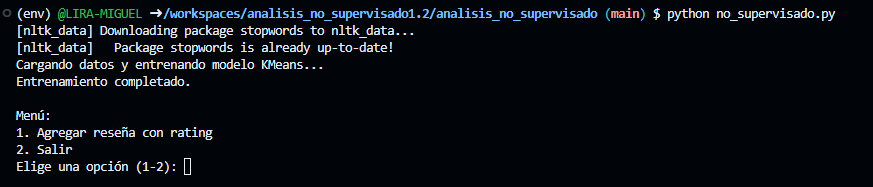
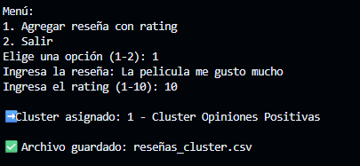
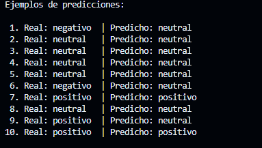
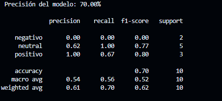
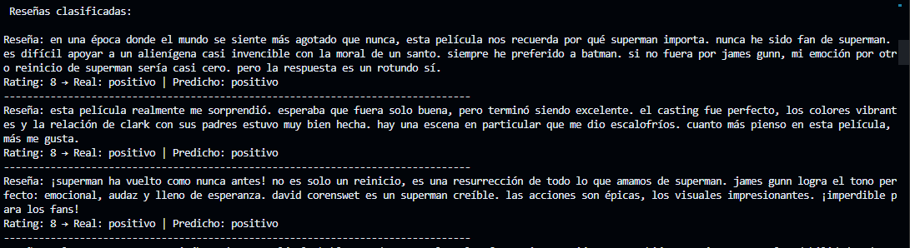

# Proyecto de Análisis de Reseñas de Superman

Este repositorio contiene el análisis de sentimientos usando reseñas de la reciente película de Superman, usando técnicas de aprendizaje supervisado y no supervisado.

## Estructura de Carpetas y Archivos

### analisis_entrenamiento/

** Se intento integrar ambas tecnicas en un mismo codigo, pero se quedo incompleto ya que no reconoci los valores neutrales y negativos o los valores neutrales con los positivos**

- **app.py**  
	Script integral que realiza:
	- Preprocesamiento de datos (`resenas_superman.csv`).
	- Asignación de sentimiento a partir del rating.
	- Vectorización de textos con TF-IDF.
	- Entrenamiento de un modelo con analisis supervisado (Logistic Regression).
	- Entrenamiento de un modelo de clustering no supervisado (KMeans).
	- Exporta los resultados obtenidos de clasificación y clustering a CSV.

- **main.py**  
	Script interactivo que permite:
	- Cargar y preprocesar datos.
	- Entrenar modelos de clasificación y clustering.
	- Ingresar nuevas reseñas por consola, predecir su sentimiento y cluster, y guardarlas en `resenas_superman_ampliado.csv`.

- **resenas_superman.csv**  
	Archivo con las reseñas de la pelicula de superman.

- **resenas_superman_ampliado.csv**  
	Se guardan nuevas reseñas ingresadas desde el menú interactivo, junto con su sentimiento y cluster.

- **resultados_clustering.csv**  
	Resultados del clustering: reseña, sentimiento y cluster asignado.

- **resultados_supervisado.csv**  
	Resultados de la clasificación supervisada: reseña, sentimiento real y predicho.

- **vectorizador.pkl**  
	Archivo serializado del vectorizador TF-IDF (si se utiliza para guardar el modelo).

- **nltk_data/**  
	Carpeta con recursos de NLTK, especialmente las stopwords en español.

---

### analisis_no_supervisado/

- **no_supervisado.py** 
	Su funcion es para:
	- Preprocesar reseñas.
	- Entrenar un modelo KMeans para clustering.
	- Asignar nombres a los clusters.
	- Permitir agregar nuevas reseñas y asignarles un cluster.
	- Guardar resultados en `reseñas_cluster.csv`.

- **reseñas_cluster.csv**  
	Archivo con las reseñas y su cluster asignado.

- **resenas_superman.csv**  
	Dataset con las reseñas de la pelicula.

- **nltk_data/**  
	Recursos de NLTK para procesamiento de texto.

- **Imagenes**



Menu interactivo



Resultado donde clasifica la reseña a un cluster
---

### analisis_supervisado/

- **supervisado.py**  
	Su funcion es para:
	- Preprocesar datos y asignar sentimiento según rating.
	- Entrenar un modelo de clasificación supervisada.
	- Mostrar ejemplos de predicción, precisión, reporte de clasificación y matriz de confusión.
	- Clasificar todas las reseñas y mostrar resultados reales y predichos.

- **resenas_superman.csv**  
	Dataset para entrenar modelo con analisis supervisado

- **Imagenes**


Muestra cómo clasificó las primeras 10 reseñas



el modelo aprendió a diferenciar bien positivos y neutrales, pero los negativos los está confundiendo con neutrales.



Muestra como clasifico las reseñas del dataset
---

## Requisitos

- Python 3.8+
- pandas, scikit-learn, nltk, matplotlib, seaborn

Instala dependencias con:
```bash
pip install -r requirements.txt
```
Inicia el entorno virtual:
```bash
source env/bin/activate
```
---

## Uso

- Ejecuta `app.py` o `main.py` para análisis completo o modo interactivo.
- Ejecuta `no_supervisado.py` para clustering puro.
- Ejecuta `supervisado.py` para análisis supervisado y métricas.

---

